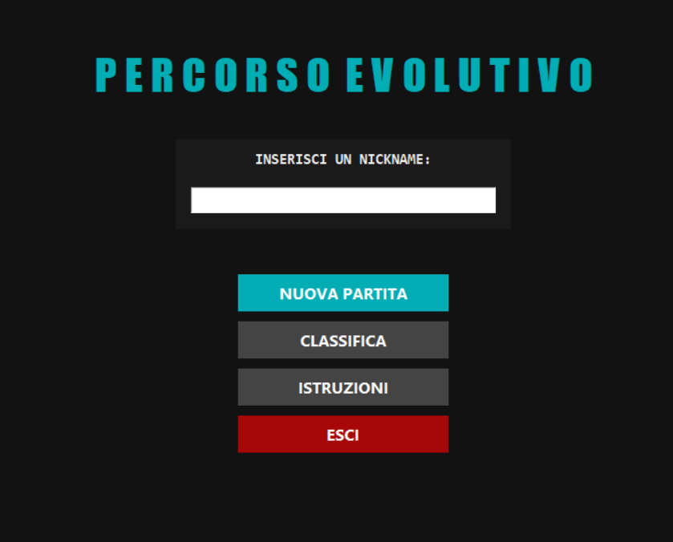
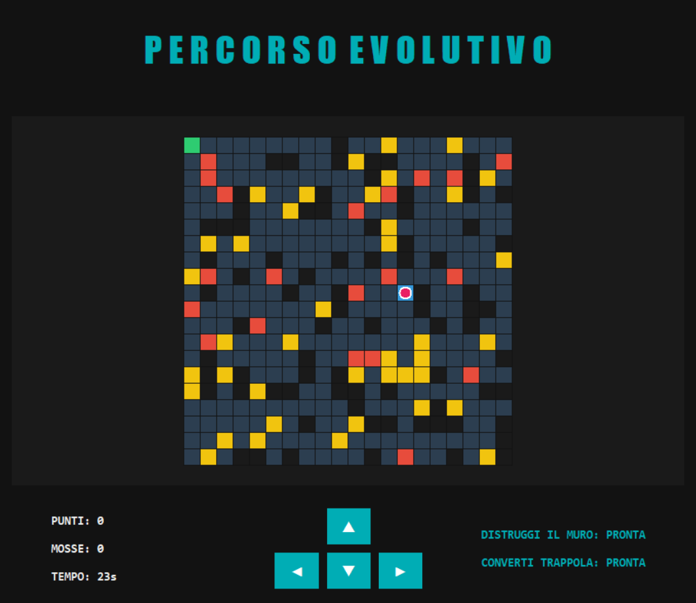
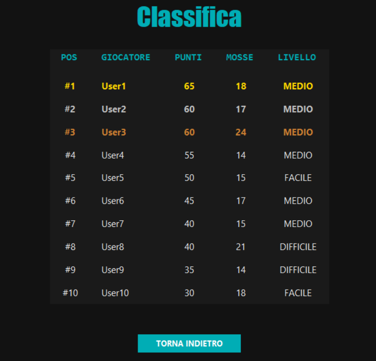

# Percorso Evolutivo
Percorso Evolutivo è un videogioco singleplayer, basato su una griglia dinamica in continua evoluzione.
Il giocatore deve raggiungere l'obiettivo tenendo d'occhio risorse, trappole e ostacoli.

## Descrizione del gioco
Il gioco si svolge su una griglia 20x20 generata automaticamente a ogni partita.
Il giocatore parte da una posizione iniziale, e deve trovare il miglior percorso per arrivare all'obiettivo, raccogliendo risorse, ed evitando trappole.
La griglia evolve nel tempo, rendendo il gioco più dinamico

## Anteprima
<table style="width:100%; table-layout: fixed;">
  <tr valign="top">
    <td align="center">
      
       
      <b>Menù Principale</b>
    </td>
    <td align="center">
      
       
      <b>Gioco</b>
    </td>
    <td align="center">
      
       
      <b>Classifica</b>
    </td>
  </tr>
</table>
 
## Architettura del Software
Il cuore del progetto risiede nella sua struttura, che rende il software facile da mantenere e da espandere

### Pattern MVC
Il progetto è stato sviluppato utilizzando il pattern architetturale <a href="https://en.wikipedia.org/wiki/Model%E2%80%93view%E2%80%93controller">Model-View-Controller (MVC)</a> al fine di separare la logica di business e l'interfaccia grafica.
  
Nello specifico di questo progetto:
* **Model:** Rappresenta il cuore logico, e contiene classi come 'Game', 'Grid', 'Player' e il Pathfinder. Queste classi lavorano unicamente sulla logica del programma e non sanno dell'esistenza delle views
* **View:** Gestisce l'interfaccia grafica. Tutte le classi view ereditano da una classe astratta 'BaseView' e vengono gestite da una classe principale 'MainView' che contiene tutte le classi e coordina la transizione da un'interfaccia all'altra.
* **Controller:** Agisce come intermediario. Riceve i comandi dalle View (es. pressione di un tasto sulla griglia, richiesta di inizio nuova partita) e interroga il Model. Successivamente, istruisce la View su cosa mostrare.

## Diagramma UML
Per capire al meglio la struttura del progetto, è stato redatto il diagramma UML delle classi. Questo documento descrive dettagliatamente le relazioni tra le classi, insieme ai loro attributi e metodi rendendo esplicita l'implementazione del Pattern MVC

